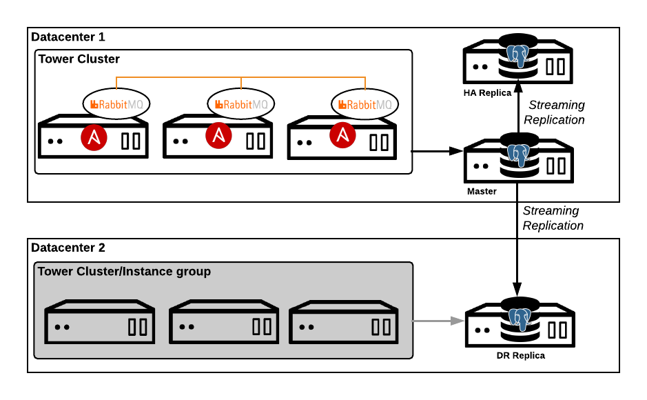
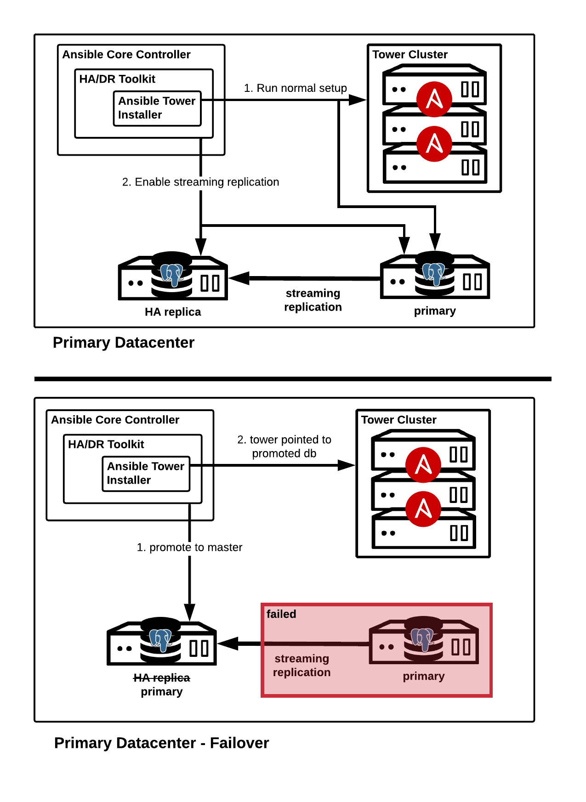
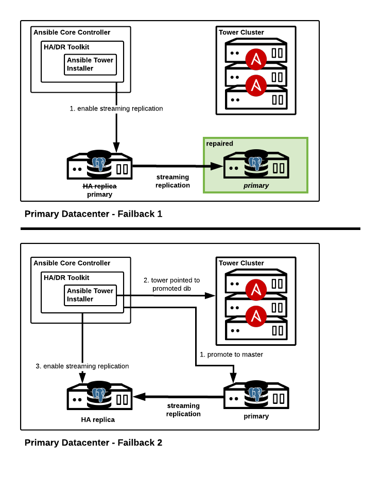
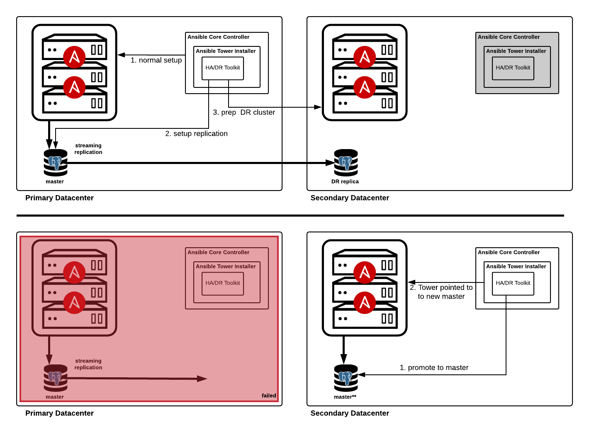
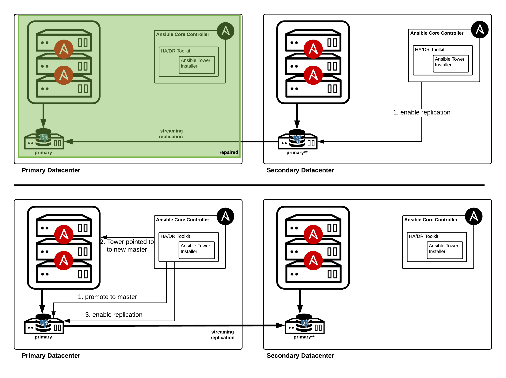
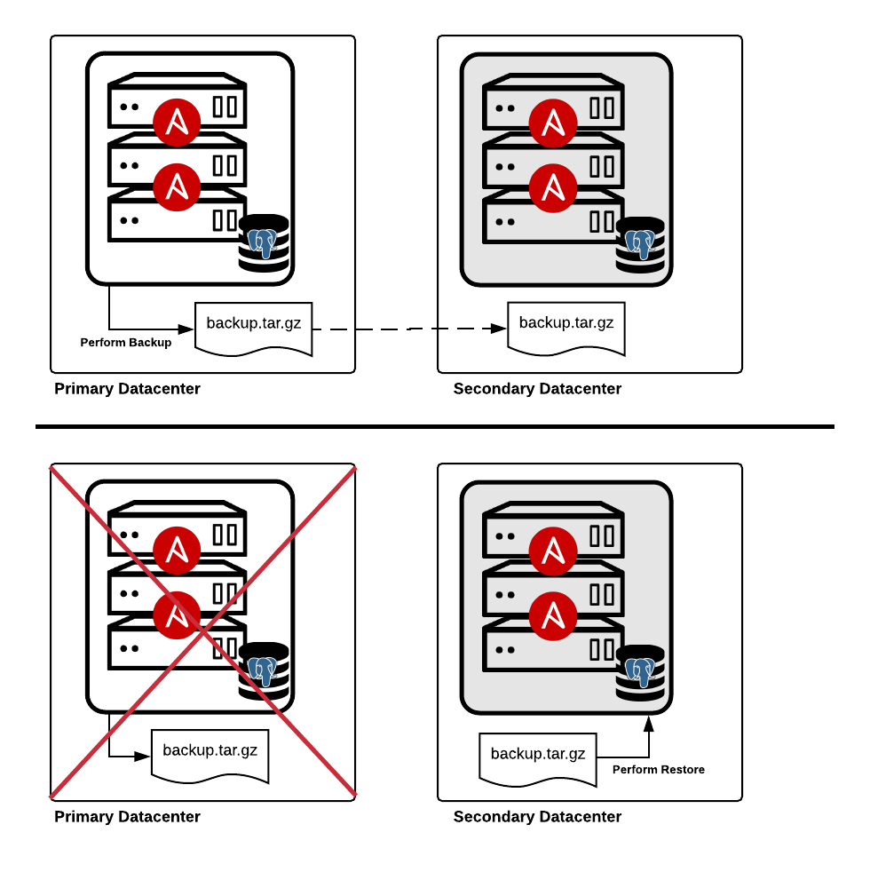

<span style="color:blue">**NOTICE: THIS TOOLKIT DOES NOT WORK FOR TOWER VERSION 3.6**</span>

Configure High Availability and/or Disaster Recovery on a Tower Cluster
==

**Supportability**

This toolkit is not officially supported by Red Hat Ansible support/engineering and is provided as is.  It is intended a starting point for a Red Hat Consulting delivery of Ansible Tower.

**Solution Reference Architecture**


This diagram represents the reference architecture for a full high availability and disaster recovery solution.  This solution can be individually tailored to address a single availability solution.  For example, if only disaster recovery is needed the configuration supports exclusion of the HA replica.

[Link to Lucidchart diagrams](https://www.lucidchart.com/invitations/accept/a1aec260-8a48-4752-894c-c3c2112688c8)

### High Availability

[Ansible Tower clustering](https://docs.ansible.com/ansible-tower/latest/html/administration/clustering.html) provides increased availability by distributing jobs across nodes in a cluster. A failure of a single node results in reduced capacity in the cluster. The database remains a single point of failure in a cluster.  If the the database becomes unavailable the cluster will also become unavailable.  This configuration provides for a replica database (HA Replica) in the primary cluster datacenter, which can be transitioned to primary.  Although not completely automated, this provides for faster recovery in database outage scenarios.

**NOTE: In the future this feature will delivered and supported by a third party.**

HA Failover


HA Failback


### Disaster Recovery

Ansible Tower clusters are not recommended to span datacenter boundaries due to latency and outage concerns.  In the event of a total datacenter failure Ansible Tower would become unavailable.  The Ansible Tower disaster recovery approach allows for failover to pre-provisioned resources in a secondary datacenter.  The database in the secondary datacenter configured as a warm standby/replica of the database in the primary datacenter.  During a failover, Ansible Tower is installed onto the pre-provisioned nodes and pointed to the replica database (promoted to primary)

DR Failover


DR Failback


*Streaming Replication*

[PostgreSQL](https://www.postgresql.org/) provides built in mechanisms to achieve increased availability.  The use of [warm standby or replica databases](https://www.postgresql.org/docs/9.3/static/warm-standby.html) allows for simple and fast failover in recovery scenarios.  

### Configuration

#### Assumptions/Prerequisites

- **all Ansible Tower machines specified in inventory are pre-provisioned with authentication mechanism known (password, SSH keys)**

- **only the Ansible Tower bundled installer is supported**

- Ansible control machine (RHEL 7/8 or CentOS 7/8) available and configured with *Ansible 2.8+*

- In order to use this toolkit you *must use key authentication*.  If you are not using the root account, need to escalate and escalation requires re-authorization you must put the `ansible_become_password` in your inventory files.  If you wish to vault values in your inventory file(s) you need to set the `tower_vault_file` variables in the `tower-vars.yml`.  You also need to append `--vault-password-file` to any playbook runs listed below.

- The bundle installation media will need to be placed in the `tower_installer` directory.  Please ensure the bundle is available before preceding.

- The Ansible Tower installation inventory for each configuration will need to be defined.

- This toolkit and the playbook suite is meant to be run by a one user at a time and one playbook at a time.   For example, do not try running multiple instances of the `tower-setup-replication.yml` playbook from the same playbook_dir.  Issues can arise because a dynamic inventory script is used with a tmp file indicating which file to load.  This mechanism allows to effectively change the inventory during playbook execution.

- This toolkit and the playbook suite is meant to be run by one user at a time and one playbook at a time.   For example, do not try running multiple instances of the `tower-setup-replication.yml` playbook from the same playbook_dir.  Issues can arise because a dynamic inventory script is used with a tmp file indicating which file to load.  This mechanism allows to effectively change the inventory during playbook execution.  

#### Setup

1. Clone this repository to the configure Ansible control machine and enter directory

  ```
  git clone https://github.com/redhat-cop/automate-tower-ha-dr.git
  cd automate-tower-ha-dr
  ```

2. Create a directory for your Tower installation inventories.  Create the appropriate `inventory_pm`, `inventory_ha` and `inventory_dr` Tower installation inventory files in the directory.  Examples are provided in the [inventory_dr_static](inventory_dr_static) and [inventory_ha_dr](inventory_ha_dr) directories of this repository.

  Some points to note about your Ansible Tower inventory files:

  - Each inventory represents a separate configuration for Tower (primary, HA, DR)

  - You must define a primary inventory(`inventory_pm`) along with *_one or both_* of the HA inventory(`inventory_ha`) and DR inventory(`inventory_dr`)

  - There should be no overlap between primary/HA and disaster recovery instance groups including the default `tower` instance group across inventory files,  This goes back to the discussion above that instance groups cannot span datacenters.   

  - Isolated instance groups will be unaffected by this process.  In a failover the isolated instance groups will remain unchanged. If one or more of the isolated instances is in the failed datacenter you may consider disabling them.
  
  - There should be no overlap between primary/HA and disaster recovery instance groups, including the default `tower` instance group, across inventory files.  This goes back to the discussion above that instance groups cannot span datacenters.   Isolated instance groups can be repeated if you wish to utilize existing isolated nodes.

  - The `database` and `database_replica` group membership should be unique across all inventory files.  The `database` group should have only one database and is the database in use the the given configuration.  The `database_replica` groups contain the streaming replicas to be configured.

  - If an external database team is managing the Ansible Tower database and handling the replication and failover, the `database_replica` group can be excluded and  `tower_db_external` set to `true`  (explained below) to skip any replication configuration

  - The example inventory files show various configurations for setting up replication in a failover scenario.

    * The HA inventory file, used in HA failover, has streaming replication configured back to the original master and DR database.  This is optional but in order to 'failback', replication to the original master must be re-enabled.

    * The DR inventory file, used in DR failover, has streaming replication configured back to the original master and leaves replication to the HA database.  This is optional but in order to 'failback', replication to the original master must be re-enabled.


  **Inventory Examples**

  [inventory_ha_dr/inventory_pm](inventory_ha_dr/inventory_pm)

  ```
  [tower]
  towervm1 ansible_ssh_host="10.26.10.50"

  [database]
  towerdb1 ansible_host="10.26.10.20"

  [database_replica]
  towerdb2 ansible_host="10.26.10.21" pgsqlrep_type=local
  towerdb3 ansible_host="10.26.10.22" pgsqlrep_type=remote

  [database_all:children]
  database
  database_replica

  [database_all:vars]
  pgsqlrep_password=password4

  [all:vars]
  <<CLIPPED>>
  pg_host='10.26.10.20'
  <<CLIPPED>>
  ```

  [inventory_ha_dr/inventory_dr](inventory_ha_dr/invnetory_dr)

  ```
  [tower]
  towervm2 ansible_host="10.26.10.51"

  [database]
  towerdb3 ansible_host="10.26.10.22"

  [database_replica]
  towerdb1 ansible_host="10.26.10.20" pgsqlrep_type=remote

  [database_all:children]
  database
  database_replica

  [database_all:vars]
  pgsqlrep_password=password4

  [all:vars]
  <<CLIPPED>>
  pg_host='10.26.10.22'
  <<CLIPPED>>
  ```

  [inventory_ha_dr/inventory_ha](inventory_ha_dr/inventory_ha)
  ```
  [tower]
  towervm1 ansible_host="10.26.10.50"

  [database]
  towerdb2 ansible_host="10.26.10.21"

  [database_replica]
  towerdb1 ansible_host="10.26.10.20" pgsqlrep_type=local
  towerdb3 ansible_host="10.26.10.22" pgsqlrep_type=remote

  [database_all:children]
  database
  database_replica

  [database_all:vars]
  pgsqlrep_password=password4

  [all:vars]
  <<CLIPPED>>
  pg_host='10.26.10.21'
  <<CLIPPED>>
  ```

3. Copy `tower-vars-base.yml` to `tower-vars.yml` for customization in your environments

  ```
  cp tower-vars-base.yml tower-vars.yml
  ```

4. Modify the `tower-vars.yml` file for your environment.  A description of the most commonly customized values are provided below. This includes definition of the inventory file for each configuration (primary/normal, HA, DR) and referencing their location.  **This file will be read in by all toolkit playbooks**

  ```
  # version of Ansible Tower to install/working with
  tower_version: 3.6.3-1

  # determine EL bundle version to use
  tower_bundle_version: el7

  # list of Ansible tower installer inventory files for each configuration
  # exclude tower_inventory_ha or tower_inventory_dr if only using one configuration
  tower_inventory_pm: inventory_ha_dr/inventory_pm
  tower_inventory_dr: inventory_ha_dr/inventory_dr
  tower_inventory_ha: inventory_ha_dr/inventory_ha

  # indicate whether the database is managed by the installer and toolkit or
  # provided as a service.  If set to true, all replication configuration is skipped
  tower_db_external: false

  # indicate vault password file.  presence of this var indicates vault is used
  #tower_vault_file: .vault-pass
  ```

5. Run the `tower-setup.yml` playbook.  This playbook will download the tower installation media for you installation if `-e tower_download=1` is passed followed by a run of the installer.  The version to be downloaded and/or used in the installation is found in the `tower-vars.yml` file.

    If you are running in a disconnected environment ensure the installer bundle is already downloaded.  For example for 3.6.3 ensure `tower-installer/ansible-tower-setup-bundle-3.6.3.-1.el7.tar.gz` is in place

  ```
  ansible-playbook tower-setup.yml
  ```

6. Run the `tower-dr-standup.yml` to prepare the failover cluster and configure replication.

  ```
  ansible-playbook tower-dr-standup.yml
  ```

  If applicable, you may want to check the status of the replication

  ```
  ansible-playbook tower-check-replication.yml
  ```


At this point the secondary/DR machines are ready for failover and streaming replication enabled

#### HA Failover

_only applicable if using an HA configuration_

In the event of a database outage in the primary database the following playbook can be run to failover to the HA replica

```
ansible-playbook tower-ha-failover.yml
```

Once the primary database has been repaired you must re-enable replication to synchronize data before failing back.  Also ensure the `database_replica` group has the repaired database host if you took it out before doing the HA failover.  The easiest way to enable the replication is to re-run the failover playbook.

```
ansible-playbook tower-ha-failover.yml
```

This won't have any effect on the running cluster but will re-enable replication.  If you wish to be more targeted/explicit you can also run

```
ansible-playbook -i INV_DIR/inventory_ha tower-setup-replication.yml
```

##### HA Failback
to failback to the original configuration

```
ansible-playbook tower-ha-failover.yml -e 'tower_failback=1'
```
#### DR Failover

_only applicable if using a DR configuration_

In the event of a primary datacenter outage, the playbook can be run to failover to the secondary database (including pointing to the DR replica)

```
ansible-playbook tower-dr-failover.yml
```

##### DR Failback

###### Considerations

Once the primary datacenter has been repaired you must re-enable replication to synchronize data before failing back.  Also ensure the `database_replica` group has the repaired database host if you took it out before doing the DR failover.  The easiest way to enable the replication is to re-run the failover playbook

```
ansible-playbook tower-dr-failover.yml
```

This won't have any effect on the running cluster but will re-enable replication.  If you wish to be more targeted/explicit you can also run

```
ansible-playbook -i INV_DIR/inventory_dr tower-setup-replication.yml
```


###### Perform Failback

to failback to the original configuration

```
ansible-playbook tower-dr-failover.yml -e 'tower_failback=1'
```

**Backup and Restore**

[Ansible Tower Backup and Restore Documentation](https://docs.ansible.com/ansible-tower/latest/html/administration/backup_restore.html#backup-and-restore-for-clustered-environments)



**Clustering**

In addition to the base single node installation, Tower offers [clustered configurations](https://docs.ansible.com/ansible-tower/latest/html/administration/clustering.html) to allow users to horizontally scale job capacity (forks) on nodes.  It is recommended to deploy tower nodes in odd numbers to prevent issues with underlying RabbitMQ clustering.

Tower clustering minimizes the potential of job execution service outages by distributing jobs across the cluster.
For example, if you have an Ansible Tower installation with a three node cluster configuration and the Ansible Tower services on a node become unavailable in the cluster, jobs will continue to be executed on the remaining two nodes.  It should be noted, the failed Ansible Tower node needs to remediated to return to a supported configuration containing an odd number of nodes.  See [setup considerations] (https://docs.ansible.com/ansible-tower/latest/html/administration/clustering.html#setup-considerations)

Tower cluster nodes and database should be geographically co-located with low latency (<10 ms) and reliable connectivity.  Deployments that span datacenters are not recommended due to transient spikes in latency and/or outages.

**Database Availability**

Ansible Tower utilizes PostgreSQL for application level data storage.  The Tower setup process does not configure streaming replica configuration/hot standby configurations, which can be used for disaster recovery or high availability solutions.  Streaming replication can be enabled and configured as a Red Hat Consulting delivered solution.  The Tower database can be replicated to high availability instance in the local datacenter and/or to a disaster recovery instance in a remote datacenter.  The later being utilized in a disaster recovery scenario.  In the case of a failure in only the local database, the high availability instance can be promoted to a primary instance and the Tower cluster updated to utilize the instance.  In the case of a full primary datacenter outage, the disaster recovery instance can be promoted to a primary instance a new Tower cluster deployed and pointed to the instance.   

**Disaster Recovery**

As discussed above, Ansible Tower clusters can not span multiple datacenters and the default setup configuration does not support multiple clusters.  This toolkit aims to provide a toolkit to bring a secondary cluster online.
