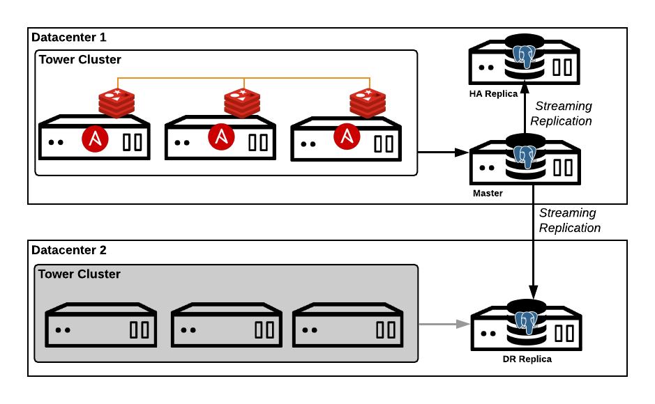

Configure High Availability and/or Disaster Recovery on a Tower Cluster
================================

**Reference Architecture**


This diagram represents the reference architecture for a full high availability and disaster recovery solution.

[Link to Lucidchart diagrams](https://www.lucidchart.com/invitations/accept/10913de1-7235-4ede-a975-38c69a517a56)

*High Availability*

[Ansible Tower clustering](https://docs.ansible.com/ansible-tower/latest/html/administration/clustering.html) provides increased availability by distributing jobs across nodes in a cluster. A failure of a single node will simply result in reduced capacity in the cluster.  The database remains a single point of failure in a cluster.  If the the database becomes unavailable the cluster will also become unavailable.  This configuration provides for a replica database (HA Replica) in the primary cluster datacenter, which can be transitioned to primary.  Although not completely automated, this provides for faster recovery in database outage scenarios.

**NOTE: In the future this feature will delivered and supported by a third party.**

HA Failover


HA Failback


*Disaster Recovery*

Ansible Tower clusters are not recommended to span datacenter boundaries due to latency and outages concerns.  In the event of a total datacenter failure Ansible Tower would become unavailable.  The Ansible Tower disaster recovery approach allows for failover to pre-provisioned resources in a secondary datacenter.  The database in the secondary datacenter configured as a warm standy/replica of the database in the primary datacenter.  During a failover, Ansible Tower is installed onto the pre-provisioned nodes and pointed to the replica database (promoted to primary)

DR Failover


DR Failback


*Streaming Replication*

[PostgreSQL](https://www.postgresql.org/) provides built in mechanisms to achieve increased availability.  The use of [warm standby or replica databases](https://www.postgresql.org/docs/9.3/static/warm-standby.html) allows for simple and fast failover in recovery scenarios.  

**Configuration**

*Assumptions/Prerequisites*

- all machines are pre-provisioned with authentication mechanism known (password, SSH keys)
- if not running as root and need to use privilege escalation (eg sudo) you need to set it up in the inventory (`ansible_become=true`)
- this approach has not been tested with the bundled installer

*Setup*


1.

Clone this repository.  In its current state is has the online Ansible Tower 3.2.5 installer inside.

```
git clone ssh://git@gitlab.consulting.redhat.com:2222/towerrescue/ansible_tower_setup.git
```

If you want to pull in the latest installer you should just overwrite the existing Tower installer files by executing something like.

```
#download latest tower installer
curl https://releases.ansible.com/ansible-tower/setup/ansible-tower-setup-latest.tar.gz \
-o ansible-tower-setup-latest.tar.gz

#extract archive stripping out leading directory
tar xzf --strip-components=1 -C ansible_tower_setup
```

2.

Update the inventory_pm (primary/base inventory), inventory_ha (HA configuration inventory) and inventory_dr (DR configuration inventory) as appropriate.  The inventory_pm should contain only your primary cluster hosts and the databases you plan on replicating to. The inventory_dr should only contain your DR cluster hosts.  Only one HA ("local") database and one DR ("remote") database is supported.  These are identified by the pgsqlrep_type hostvar.  Make sure you get the right databases configured as primary and replicas in each inventory.

Here is an example of an inventory file for each coniguration

**inventory_pm (primary inventory)**
```
[tower]
towervm1 ansible_host="10.26.10.50"
towervm2 ansible_host="10.26.10.51"
towervm3 ansible_host="10.26.10.52"

[database]
towerdb1 ansible_host="10.26.10.20"

[database_replica]
towerdb2 ansible_host="10.26.10.21" pgsqlrep_type=local
towerdb3 ansible_host="10.26.10.22" pgsqlrep_type=remote

[database_all:children]
database
database_replica

[database_all:vars]
pgsqlrep_password=password4

[all:vars]
ansible_become = true
ansible_user = 'ansible_svc'
ansible_private_key_file="/path/to/key"

admin_password='password1'

pg_host='10.26.10.20'
pg_port='5432'

pg_database='awx'
pg_username='awx'
pg_password='password3'

rabbitmq_port=5672
rabbitmq_vhost=tower
rabbitmq_username=tower
rabbitmq_password='password2'
rabbitmq_cookie=cookiemonster

# Needs to be true for fqdns and ip addresses
rabbitmq_use_long_name=true
```

**inventory_ha (high availability inventory)**
```
[tower]
towervm1 ansible_host="10.26.10.50"
towervm2 ansible_host="10.26.10.51"
towervm3 ansible_host="10.26.10.52"

[database]
towerdb2 ansible_host="10.26.10.21"

[database_replica]
#TOWER DR - optional. enable when you wish to enable replication for failback
towerdb1 ansible_host="10.26.10.20" pgsqlrep_type=local
towerdb3 ansible_host="10.26.10.22" pgsqlrep_type=remote

[database_all:children]
database
database_replica

[database_all:vars]
pgsqlrep_password=password4

[all:vars]
ansible_become = true
ansible_user = 'ansible_svc'
ansible_private_key_file="/path/to/key"

admin_password='password1'

pg_host='10.26.10.21'
pg_port='5432'

pg_database='awx'
pg_username='awx'
pg_password='password3'

rabbitmq_port=5672
rabbitmq_vhost=tower
rabbitmq_username=tower
rabbitmq_password='password2'
rabbitmq_cookie=cookiemonster

# Needs to be true for fqdns and ip addresses
rabbitmq_use_long_name=true
```


**inventor_dr (disaster recovery inventory)**
```
[tower]
towervm4 ansible_host="10.26.10.60"
towervm5 ansible_host="10.26.10.61"
towervm6 ansible_host="10.26.10.62"

[database]
towerdb3 ansible_host="10.26.10.22"

[database_replica]
#TOWER DR - optional. enable when you wish to enable replication for failback
towerdb1 ansible_host="10.26.10.20" pgsqlrep_type=remote

[database_all:children]
database
database_replica

[database_all:vars]
pgsqlrep_password=password4

[all:vars]
ansible_become = true
ansible_user = 'ansible_svc'
ansible_private_key_file="/path/to/key"

admin_password='password1'

pg_host='10.26.10.22'
pg_port='5432'

pg_database='awx'
pg_username='awx'
pg_password='password3'

rabbitmq_port=5672
rabbitmq_vhost=tower
rabbitmq_username=tower
rabbitmq_password='password2'
rabbitmq_cookie=cookiemonster

# Needs to be true for fqdns and ip addresses
rabbitmq_use_long_name=true
```

3.

Run the Tower installer normally against your primary inventory:

```
./setup.sh -i inventory_pm
```

4.

Run the playbook to ensure the samdoran.pgsql-replication roles is installed. `ansible-playbook tower_role_check.yml`.  If you don not have connectivity to github you'll need to download the tar archive and pass the path to the playbook, `ansible-playbook tower_role_check.yml -e replication_role_archive=ROLE_TGZ_ARCHIVE_LOCATION`

4) Run the the playbook to setup replication to the local and/or remote databases `ansible-playbook -i inventory_pm tower_setup_replication.yml`.  You can check the status of replication by running `ansible-playbook -i inventory_pm tower_check_replication.yml`

5) Run the script to prep the DR cluster for installation.  This will move the SECRET_KEY to the DR nodes. `./tower_dr_prep.sh -c inventory_pm -d inventory_dr`

You should now be ready to execute failover scenarios.

**HA failover**

NOTE: if you do not want to initialize replication back to the primary database and/or DR(remote) database you will need to remove them from the inventory. They can always be added later

To perform a HA failover, which will promote the HA/local replica database to primary and point Tower to it execute `./tower_pgsql_ha_failover.sh -c inventory_pm -a inventory_ha`

If the primary database has truly failed it can be redeployed/remediate/turned on and replication re-enabled so a "fail back" can occur but re-running `./tower_pgsql_ha_failover.sh -c inventory_pm -a inventory_ha`

One the primary database is fixe you can "fail back" to the original configuration by executing`./tower_pgsql_ha_failover.sh -c inventory_pm -a inventory_ha -b`.


**DR failover**

NOTE: if you do not want to initialize replication back to the primary database and/or HA(local) database you will need to remove them from the inventory.  They can always be added later

To perform a DR failover which will promote the DR/remote replication database to primary, run the tower installer against the DR nodes/newly promoted DR database and remove previous primary nodes execute `./tower_dr_failover.sh -c inventory_pm -d inventory_dr`

Once the primary cluster is repaired you should re-run the failover to setup to enable replication. `./tower_dr_failover.sh -c inventory_pm -d inventory_dr`

To "fail back" to the original configuration and primary cluster execute. `./tower_dr_failover.sh -c inventory_pm -d inventory_dr -b`


**Backup and Restore**

https://docs.ansible.com/ansible-tower/latest/html/administration/backup_restore.html#backup-and-restore-for-clustered-environments

**Other failovers**

If you want to do a DR failover from the HA failover configuration execute `./tower_dr_failover.sh -c inventory_ha -d inventory_dr`

**Why are you using bash scripts?**

Because people make mistakes when there are too many manual steps.  The shell scripts are simple, only run ansible scripts and can easily be teased apart into the individual playbook runs.


Ansible Tower Clustering/High Availability and Disaster Recover
===============================================================


**Clustering**

In addition to the base single node installation, Tower offers [clustered configurations](https://docs.ansible.com/ansible-tower/3.2.4/html/administration/clustering.html) to allow users to horizontally scale job capacity (forks) on nodes.  It is recommended to deploy tower nodes in odd numbers to prevent issues with underlying RabbitMQ clustering.

Tower clustering minimizes the potential of job execution service outages by distributing jobs across the cluster.
For example, if you have an Ansible Tower installation with a three node cluster configuration and the Ansible Tower services on a node become unavailable in the cluster, jobs will continue to be executed on the remaining two nodes.  It should be noted, the failed Ansible Tower node needs to remediated to return to a supported configuration containing an odd number of nodes.  See [setup considerations] (https://docs.ansible.com/ansible-tower/latest/html/administration/clustering.html#setup-considerations)

Tower cluster nodes and database should be geographically co-located with low latency (<10 ms) and reliable connectivity.  Deployments that span datacenters are not recommended due to transient spikes in latency and/or outages.

**Database Availability**

Ansible Tower utilizes PostgreSQL for application level data storage.  The Tower setup process does not configure streaming replica configuration/hot standby configurations, which can be used for disaster recovery or high availability solutions.  Streaming replication can be enabled and configured as a Red Hat Consulting delivered solution.  The Tower database can be replicated to high availability instance in the local datacenter and/or to a disaster recovery instance in a remote datacenter.  The later being utilized in a disaster recovery scenario.  In the case of a failure in only the local database, the high availability instance can be promoted to a primary instance and the Tower cluster updated to utilize the instance.  In the case of a full primary datacenter outage, the disaster recovery instance can be promoted to a primary instance a new Tower cluster deployed and pointed to the instance.   

**Disaster Recovery**

As discussed above, Ansible Tower clusters can not span multiple datacenters and the default setup configuration does not support m


Ansible Tower Deployment
========================

This collection of files provides a complete set of playbooks for deploying
the Ansible Tower software to a single-server installation. It is also to
install Tower to the local machine, or to a remote machine reachable by SSH.

For quickly getting started with installation and setup instructions, refer to:

- Ansible Tower Quick Installation Guide -- http://docs.ansible.com/ansible-tower/latest/html/quickinstall/index.html
- Ansible Tower Quick Setup Guide -- http://docs.ansible.com/ansible-tower/latest/html/quickstart/index.html

For more indepth documentation, refer to:

- Ansible Tower Installation and Reference Guide -- http://docs.ansible.com/ansible-tower/latest/html/installandreference/index.html
- Ansible Tower User Guide -- http://docs.ansible.com/ansible-tower/latest/html/userguide/index.html
- Ansible Tower Administration Guide -- http://docs.ansible.com/ansible-tower/latest/html/administration/index.html
- Ansible Tower API Guide -- http://docs.ansible.com/ansible-tower/latest/html/towerapi/index.html

To install or upgrade, start by editing the inventory file in this directory.
Uncomment and change the password from 'password' for the 3 variables below.
* admin_password
* pg_password
* rabbitmq_password

Tower can be installed in 3 different modes:
1. On a single machine. This is the default, and will install in this mode with
   no modifications to the inventory file.
2. On a single machine with a remote PostgreSQL database. Supplying the pg_host
   and pg_port variables will trigger this mode of installation.
3. Cluster/High Availability, multiple machines with a remote PostgreSQL database.
   Adding multiple hosts to the [tower] inventory group will trigger this mode of
   installation. Note that pg_host and pg_port are also required.

Now you are ready to run ./setup.sh. Note that root access to the remote
machines is required. With Ansible, this can be achieved in many different.
Below are a few examples.
* ansible_ssh_user=root ansible_ssh_password="your_password_here" inventory
  host or group variables
* ansible_ssh_user=root ansible_ssh_private_key_file="path_to_your_keyfile.pem"
  inventory host or group variables
* ANSIBLE_BECOME_METHOD='sudo' ANSIBLE_BECOME=True ./setup.sh
* ANSIBLE_SUDO=True ./setup.sh

> *WARNING*: The playbook will overwrite the content
> of `pg_hba.conf` and strip all comments from `supervisord.conf`.  Run this
> only on a clean virtual machine if you are not ok with this behavior.
